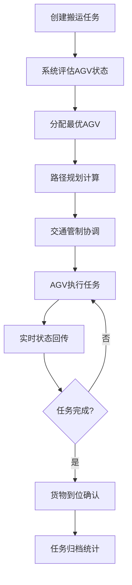
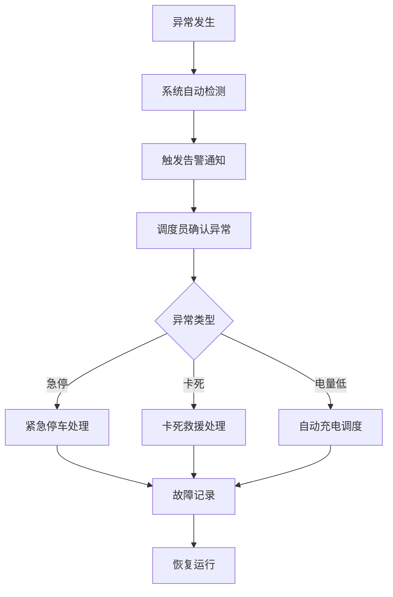

## 1. 产品概述

钢厂AGV调度物料搬运业务桌面工具，用于厂内物流调度AGV车辆、搬运任务和运输路径的综合管理平台。系统实现AGV全生命周期管理、智能任务派发、最优路径规划、路口交通管制、多车避让调度、电量监控与自动充电、异常告警处理以及实时运行看板等核心功能。

- 主要用途：提升钢厂厂内物流效率，实现AGV智能化调度与管理
- 目标用户：钢厂物流调度员、AGV运维人员、生产管理人员
- 目标价值：降低人工成本、提高搬运效率、减少安全事故、实现物流数字化管理

## 2. 核心功能

### 2.1 用户角色

| 角色 | 注册方式 | 核心权限 |
|------|----------|----------|
| 调度员 | 系统账号登录 | 任务派发、路径规划、交通管制、实时监控 |
| 运维人员 | 系统账号登录 | AGV台账管理、异常处理、充电调度 |
| 管理员 | 系统账号登录 | 全部功能权限、系统配置管理 |

### 2.2 功能模块

1. **AGV台账模块**：AGV车辆台账管理、车辆信息维护、状态监控
2. **任务派发模块**：搬运任务创建、任务派发、任务状态跟踪、货物到位确认
3. **路径规划模块**：最优路径规划、路径可视化、路径优化
4. **交通管制模块**：路口交通管制、多车避让、交通规则配置
5. **充电调度模块**：电量监控、自动充电调度、充电站管理
6. **异常处理模块**：卡死异常处理、急停告警、故障记录
7. **运行看板模块**：实时运行看板、搬运量统计、运行数据展示

### 2.3 页面详情

| 页面名称 | 模块名称 | 功能描述 |
|----------|----------|----------|
| 运行看板 | 看板总览 | 实时运行状态、AGV分布、任务统计、告警信息、搬运量趋势图 |
| AGV台账 | 车辆管理 | AGV列表、车辆详情、新增/编辑/删除车辆、车辆状态筛选 |
| 任务派发 | 任务管理 | 任务列表、新建任务、任务派发、任务进度跟踪、货物到位确认 |
| 路径规划 | 路径管理 | 地图展示、路径规划、路径对比、路径保存与调用 |
| 交通管制 | 管制管理 | 路口状态、管制规则、多车避让调度、交通流量统计 |
| 充电调度 | 充电管理 | 电量监控、充电任务、充电站状态、充电历史记录 |
| 异常处理 | 异常管理 | 异常列表、急停告警、卡死处理、故障记录与统计 |

## 3. 核心流程

### 3.1 任务调度流程

调度员在系统中创建搬运任务，系统根据AGV状态和位置自动分配最优车辆，路径规划模块计算最优路径，交通管制模块协调路口通行，AGV执行任务并实时回传状态，货物到位后确认完成。

### 3.2 异常处理流程

当AGV发生异常时，系统自动检测并触发告警，调度员确认异常类型，进行相应处理（急停、救援、重启），处理完成后恢复运行。

## 4. 用户界面设计

### 4.1 设计风格

- **主色调**：工业蓝（#1E3A5F）作为主色，搭配钢铁灰（#6B7280）作为辅助色
- **强调色**：安全橙（#F97316）用于告警和重要提示，安全绿（#10B981）用于正常运行状态
- **背景色**：深灰（#0F172A）深色主题，符合工业控制室风格
- **按钮风格**：直角硬朗风格，轻微浮雕效果，工业感强
- **字体**：使用等宽字体展示数据，无衬线字体作为标题，清晰易读
- **布局风格**：卡片式布局，模块化分区，数据仪表盘风格
- **图标风格**：线性图标，工业设备风格，简洁明了

### 4.2 页面设计概述

| 页面名称 | 模块名称 | UI元素 |
|----------|----------|--------|
| 运行看板 | 看板总览 | 顶部导航栏、左侧AGV状态列表、中央地图监控区、右侧任务与告警面板、底部统计图表 |
| AGV台账 | 车辆管理 | 顶部筛选搜索栏、车辆列表表格、车辆详情侧边栏、新增/编辑弹窗 |
| 任务派发 | 任务管理 | 任务列表、新建任务表单、任务时间线、任务状态标签 |
| 路径规划 | 路径管理 | 地图画布、路径工具栏、路径参数配置、路径对比面板 |
| 交通管制 | 管制管理 | 路口状态图、管制规则列表、避让调度面板、流量统计图表 |
| 充电调度 | 充电管理 | 电量仪表盘、充电站状态、充电队列、充电历史记录 |
| 异常处理 | 异常管理 | 告警列表、异常详情、处理操作按钮、故障统计图表 |

### 4.3 响应式设计

- 桌面优先设计，适配1920x1080及以上分辨率
- 支持窗口缩放，主要内容区域自适应
- 侧边栏可折叠，提供更大的监控视图空间
- 数据表格支持横向滚动，适配大量数据展示

### 4.4 动效与交互

- 页面加载时数据卡片渐入动画，错落有致
- AGV在地图上移动有平滑过渡效果
- 告警信息有脉冲闪烁效果，提醒注意
- 数据更新时有数字滚动动画
- 标签页切换有平滑过渡效果
- 按钮悬停有微妙的颜色和阴影变化
