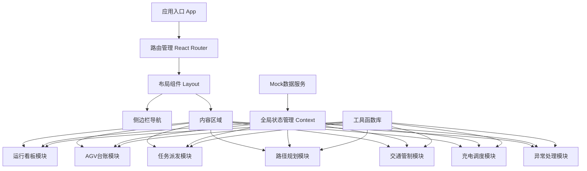
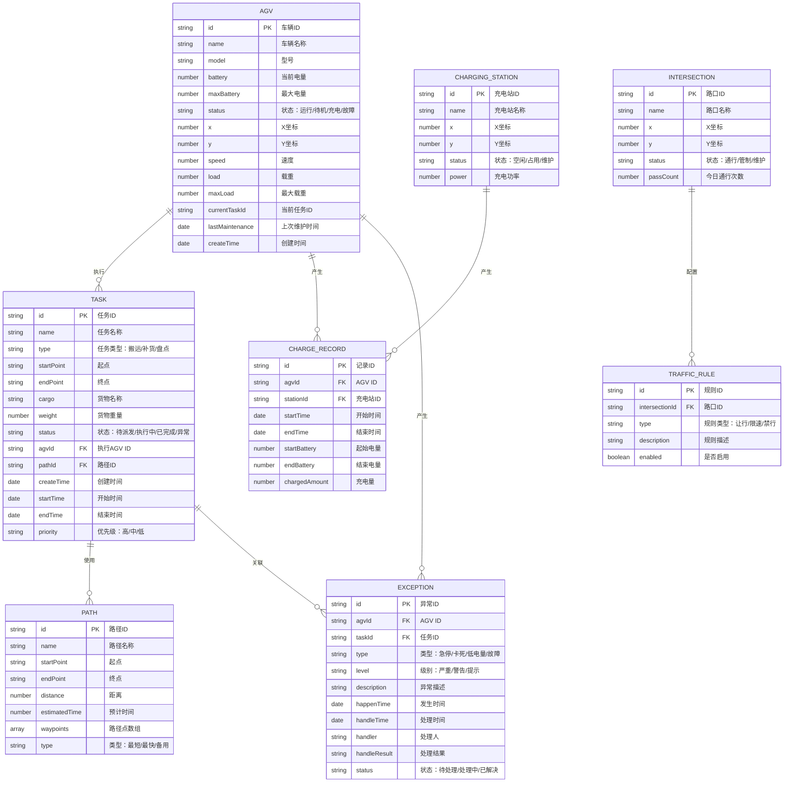

## 1. 架构设计

本系统为前端单页应用（SPA）架构，采用React框架构建，数据采用Mock数据模拟后端服务。系统整体采用组件化设计，状态管理使用React Context和Hooks，UI组件库使用Ant Design，图表使用ECharts，地图使用SVG自定义绘制。



## 2. 技术描述

- **前端框架**：React@18 + TypeScript
- **构建工具**：Vite@5
- **UI组件库**：Ant Design@5
- **图标库**：@ant-design/icons
- **状态管理**：React Context + useReducer
- **图表库**：ECharts@5 + echarts-for-react
- **样式方案**：Tailwind CSS@3 + CSS Modules
- **路由管理**：React Router@6
- **日期处理**：dayjs
- **数据模拟**：Mock.js + 本地JSON数据
- **代码规范**：ESLint + Prettier

## 3. 路由定义

| 路由路径 | 页面名称 | 功能描述 |
|----------|----------|----------|
| /dashboard | 运行看板 | 系统首页，展示实时运行状态、AGV分布、任务统计、告警信息、搬运量统计 |
| /agv-ledger | AGV台账 | AGV车辆列表、车辆详情、新增/编辑/删除车辆 |
| /task-dispatch | 任务派发 | 搬运任务列表、新建任务、任务派发、任务进度跟踪、货物到位确认 |
| /path-planning | 路径规划 | 地图展示、最优路径规划、路径可视化、路径保存 |
| /traffic-control | 交通管制 | 路口状态监控、管制规则配置、多车避让调度 |
| /charging | 充电调度 | 电量监控、自动充电调度、充电站管理、充电记录 |
| /exception | 异常处理 | 异常列表、急停告警、卡死处理、故障记录与统计 |

## 4. 数据模型

### 4.1 数据模型定义



### 4.2 状态枚举值

**AGV状态 (status):**
- `running` - 运行中
- `idle` - 待机
- `charging` - 充电中
- `fault` - 故障
- `maintenance` - 维护中

**任务状态 (status):**
- `pending` - 待派发
- `assigned` - 已派发
- `executing` - 执行中
- `completed` - 已完成
- `exception` - 异常

**异常类型 (type):**
- `estop` - 急停
- `stuck` - 卡死
- `low_battery` - 低电量
- `fault` - 故障
- `collision` - 碰撞

**异常级别 (level):**
- `critical` - 严重
- `warning` - 警告
- `info` - 提示

## 5. 模块划分

### 5.1 目录结构

```
src/
├── assets/           # 静态资源
├── components/       # 通用组件
│   ├── Layout/       # 布局组件
│   ├── Charts/       # 图表组件
│   ├── Map/          # 地图组件
│   └── common/       # 通用UI组件
├── pages/            # 页面组件
│   ├── Dashboard/    # 运行看板
│   ├── AgvLedger/    # AGV台账
│   ├── TaskDispatch/ # 任务派发
│   ├── PathPlanning/ # 路径规划
│   ├── TrafficControl/ # 交通管制
│   ├── Charging/     # 充电调度
│   └── Exception/    # 异常处理
├── store/            # 状态管理
│   ├── AgvContext.tsx
│   ├── TaskContext.tsx
│   ├── SystemContext.tsx
│   └── index.tsx
├── mock/             # Mock数据
│   ├── agv.ts
│   ├── task.ts
│   ├── path.ts
│   ├── charging.ts
│   ├── exception.ts
│   └── traffic.ts
├── utils/            # 工具函数
│   ├── pathfinding.ts # 路径规划算法
│   ├── traffic.ts    # 交通管制算法
│   ├── charging.ts   # 充电调度算法
│   └── common.ts
├── types/            # TypeScript类型定义
│   ├── agv.ts
│   ├── task.ts
│   ├── path.ts
│   ├── charging.ts
│   ├── exception.ts
│   └── traffic.ts
├── hooks/            # 自定义Hooks
├── App.tsx
├── main.tsx
└── index.css
```

### 5.2 核心算法模块

**路径规划算法 (pathfinding.ts):**
- A*算法实现最优路径搜索
- 支持多目标点路径优化
- 考虑避障和交通管制的动态路径调整

**交通管制算法 (traffic.ts):**
- 路口通行权调度
- 多车避让策略
- 死锁检测与解除

**充电调度算法 (charging.ts):**
- 低电量预警
- 充电站自动分配
- 充电优先级排序

## 6. 性能与优化

- 使用 React.memo 优化组件渲染性能
- 大数据量列表使用虚拟滚动
- 地图渲染使用Canvas/SVG按需更新
- 实时数据采用定时轮询+增量更新
- 使用React Router懒加载减少首屏加载时间
- ECharts图表使用按需引入减小包体积
